# UI/UX Audit Report — SkillSwap

This report provides a thorough design, usability, accessibility, and visual consistency audit of the SkillSwap web application. Recommendations are aimed at elevating the user experience to match modern, production-grade SaaS standards (such as Vercel, Linear, or Tailwind UI) suitable for a premium developer portfolio.

---

## Executive Summary

SkillSwap is functional and contains rich features (Auth, Projects, Hackathons, Filters, Profile Details, Chat, Notifications). However, it currently has some UI inconsistencies, minor accessibility issues, lack of micro-animations, and inconsistent layout wrappers that detract from a premium product feel. 

Applying these recommendations will transform the app from a "bootcamp project" look to a polished, professional developer network.

---

## Page-by-Page Audit & Recommendations

### 1. Landing (Home) Page

| Issue | Severity | Why It Matters | Proposed Solution | Est. Effort |
| :--- | :--- | :--- | :--- | :--- |
| **Default Font & Visual Stiffness** | Medium | The landing page is the first impression. Default browser fonts and static layouts make the site feel basic. | Integrate Google Fonts (e.g., *Inter* or *Outfit*), apply subtle background grid gradients (`bg-[radial-gradient]`), and introduce hover scales on feature blocks. | Low (2 hours) |
| **Inconsistent Navbars** | High | The landing page uses a custom `Navbar.jsx` with basic styles, while protected pages use `TopNavbar.jsx`. This breaks identity consistency. | Consolidate navbars. Refactor `TopNavbar.jsx` to dynamically render signup/login actions when unauthenticated, and dashboard navigation when logged in. | Low (2 hours) |
| **Static Hero Section** | Low | Static landing pages reduce engagement. | Add a sliding tech stack badges marquee or animated code block snippet demonstrating "how skill swapping works". | Low (1 hour) |

### 2. Dashboard Page

| Issue | Severity | Why It Matters | Proposed Solution | Est. Effort |
| :--- | :--- | :--- | :--- | :--- |
| **Grid Alignment & Cards Size** | Medium | Current list layouts mix different card heights, causing jagged grids (masonry layout errors). | Implement unified grid height limits (`h-full` on cards with flex layouts) so all student, project, and hackathon cards align perfectly. | Low (1 hour) |
| **Inconsistent Tab Transitions** | Low | Instant content switches without animation feel abrupt. | Add a sliding track effect for active tabs and a subtle slide-in fade-in transition (`transition-all duration-300 opacity-0 translate-y-2`) for panel contents. | Low (2 hours) |
| **No Filter State Indication** | Medium | Users looking at filtered student lists are not reminded that active filters are applied. | Render small filter badges (e.g. `React ×`) above the cards. Clicking the badge clears that specific filter. | Low (2 hours) |

### 3. Projects (Explore Projects) Page

| Issue | Severity | Why It Matters | Proposed Solution | Est. Effort |
| :--- | :--- | :--- | :--- | :--- |
| **Basic Inputs & Select Dropdowns** | Medium | Standard browser select borders and shadows look generic. | Style dropdown select containers using custom chevron icons, relative containers, custom focus indicators (`ring-2 ring-indigo-200 focus:border-indigo-500`), and smooth shadows. | Low (2 hours) |
| **Abrupt Loading States** | Medium | A blank screen or raw "Loading..." text during debounced search fetches breaks usability. | Integrate skeleton loaders (shimmering grey block placeholders) that match the exact shape of project cards. | Medium (3 hours) |
| **Missing Empty States Action** | Low | When no projects match filters, users see a blank box with "No projects found" but no next steps. | Add a prominent "Reset Filters" button inside the empty state block to allow fast recovery. | Low (1 hour) |

### 4. Project Details Page

| Issue | Severity | Why It Matters | Proposed Solution | Est. Effort |
| :--- | :--- | :--- | :--- | :--- |
| **Lacks Visual Hierarchy** | High | Project detail fields (technologies, max members, status) are stacked vertically as plain text list rows, making it hard to scan. | Redesign details layout: render key metrics (Difficulty, Mode, Slots Left) as styled dashboard metrics boxes. Render technologies as color-coded tags. | Medium (3 hours) |
| **Missing Action Confirmations** | Medium | Clicking "Join Project" immediately adds the user or sends request without a confirmation modal, leading to accidental joins. | Add a lightweight pop-up confirmation dialog ("Are you sure you want to join this project?"). | Low (2 hours) |

### 5. Hackathons Page & Details

| Issue | Severity | Why It Matters | Proposed Solution | Est. Effort |
| :--- | :--- | :--- | :--- | :--- |
| **Date & Time Formatting** | Low | Showing raw date formats (e.g. `2026-07-15T00:00:00.000Z`) looks unprofessional. | Format all dates using standard `toLocaleDateString` configs (e.g., `July 15, 2026`). | Low (1 hour) |
| **Registration Deadline Warning** | Medium | Approaching registration deadlines are not highlighted, reducing registration urgency. | If the deadline is within 48 hours, render the date badge with a soft yellow warning background and an exclamation indicator (`⚠️ Closes Soon`). | Low (1 hour) |

### 6. Profile & User Profiles

| Issue | Severity | Why It Matters | Proposed Solution | Est. Effort |
| :--- | :--- | :--- | :--- | :--- |
| **Raw Asset URLs Input** | Low | Before upload helper integration, users manually input profile picture URLs. The input field is still visible. | Clean up the text input field for URLs in the edit modal. Rely completely on the file upload file selector to avoid messy URLs. | Low (1 hour) |
| **Empty Social Link Badges** | Medium | If a developer hasn't added GitHub, LinkedIn, or Portfolio URLs, rendering empty gaps or standard placeholders feels broken. | Dynamically hide social link buttons/cards if their corresponding URLs are empty in the user's data object, or display them as greyed-out unlinked states. | Low (1 hour) |

### 7. Chat (Inbox) Page

| Issue | Severity | Why It Matters | Proposed Solution | Est. Effort |
| :--- | :--- | :--- | :--- | :--- |
| **No Typing Indicator** | Low | Users cannot tell if the other developer is typing, making conversations feel static. | Implement a minor 3-dot bouncing typing indicator when text input is focused (once WebSockets are introduced). | Low (2 hours) |
| **Inconsistent Scroll Anchor** | Medium | Opening a chat thread or sending a message can sometimes cause visual jumps. | Ensure `scrollIntoView({ behavior: 'smooth' })` is strictly triggered once messages state loads, keeping focus pinned to the bottom. | Low (1 hour) |

### 8. Notifications Center

| Issue | Severity | Why It Matters | Proposed Solution | Est. Effort |
| :--- | :--- | :--- | :--- | :--- |
| **Plain Text Content** | Low | Plain text descriptions of notifications make it hard to tell what resource they belong to. | Wrap project and hackathon names in bold tags. Make the entire notification card clickable, directly navigating to the relevant project details, hackathon details, or chat. | Low (2 hours) |
| **No Notification Sound/Visual Toast** | Low | If users are on another page, they don't get live alerts for new messages or requests. | Integrate a lightweight visual toast notifier (like `react-hot-toast` or custom absolute overlay) that pops up on the screen when a new polled notification is detected. | Medium (3 hours) |

---

## Prioritized Implementation Roadmap

Based on the audit, the recommended timeline for polish is structured from highest severity/impact to lowest:

```mermaid
gantt
    title SkillSwap UI/UX Polish Roadmap
    dateFormat  X
    axisFormat %d
    section Phase 1: High Priority
    Consolidate Navbar Consistency      :active, 0, 3
    Consolidate Card Grids & Alignments :active, 3, 5
    Detail Pages Metrics & Hierarchy     :active, 5, 8
    section Phase 2: Medium Priority
    Shimmer Skeleton Loaders            : 8, 12
    Date Formatter Helpers             : 12, 14
    Filter Badges & Clear Actions      : 14, 17
    section Phase 3: Low Priority
    Tab & Card Micro-Animations        : 17, 21
    Dynamic Social Icon Rules          : 21, 23
```

